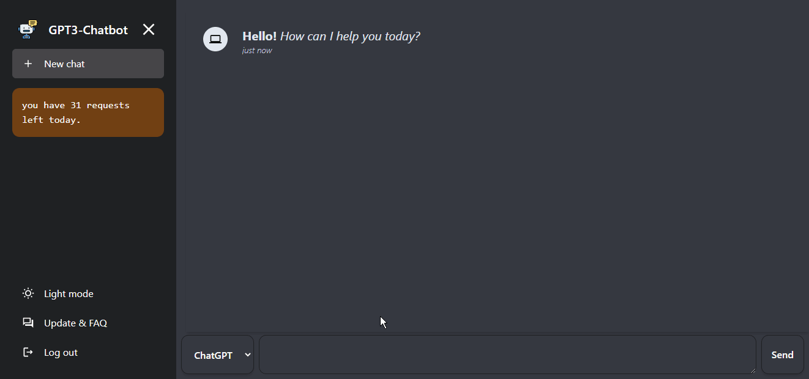

# ChatGPT clone with DALL.E image generation model

An electron/desktop application for ChatGPT clone.

> a demo of the App


**Give it a ⭐ if you liked it 😜**

## install

### Running the browser client (dev)
```bash
cd client && npm i
npm start
```

## Configuration
1. obtain your openai api key from [here](https://openai.com)
2. run the app, click API Key, enter it, start chatting. *it will be stored only in memory and not saved across sessions

## Build
```bash
cd client && npm run build
```

Then update `desktop/index.html` CSS and JS files to point to updated/built `client/` files. Then use forge to build.

```bash
cd desktop && npm run package
```

### to run client only in the browser
```bash
cd client
npm start
```

***Tech used***
  - openai API
  - react
  - tailwindcss
  - react-icons
  - react-markdown


## credits
- [OpenAI](https://openai.com) for creating [ChatGPT](https://chat.openai.com/chat)
- [eyucoder](https://github.com/eyucoder/chatgpt-clone) for creating initial react client

## 📝 License

>This project is released under the Apache License 2.0 license.
See [LICENSE](./LICENSE) for details.
